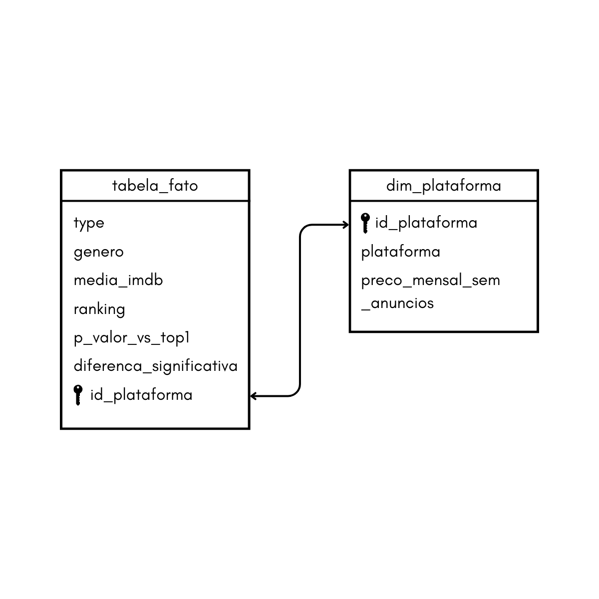

# MVP Engenharia de dados
## Definição do problema: Qual o custo benefício 
Em 2007, a netflix se tornou pioneira e dominante no mercado de streaming global. Hoje existem diversas plataformas de streaming que oferecem o mesmo serviço de diferentes maneiras. Uma das formas de diferenciação entre essas plataformas é o catálogo de filmes e séries que elas oferecem para o público. Consumidores diferenciam-se nas preferências de gênero de filmes e séries que consomem, o que pode influenciar na escolha de assinatura. Por exemplo, se uma pessoa assiste apenas filmes e séries de comédia, qual é a melhor plataforma para ela assinar? E se duas plataformas forem muito semelhantes oferecendo conteúdo de comédia, mas uma for muito mais barata que a outra?  
## Objetivo
Considerando essa variação de gosto pessoal pelo consumo de conteúdo audiovisual e a variação de preço que existe entre plataformas, esse trabalho visa identificar quais plataformas oferecem os melhores serviços filmes e séries para determinada preferência. Serão analizados apenas os planos sem anúncios para fins de padronização das comparações.
## Coleta dos dados
Os dados foram coletados na base de dados do Kaggle (https://www.kaggle.com/datasets) nos seguintes links:

- Prime video =  https://www.kaggle.com/datasets/octopusteam/full-amazon-prime-dataset
- Netflix = https://www.kaggle.com/datasets/octopusteam/full-netflix-dataset
- HBO =  https://www.kaggle.com/datasets/octopusteam/full-hbo-max-dataset
- Hulu =  https://www.kaggle.com/datasets/octopusteam/full-hulu-dataset
- Apple TV = https://www.kaggle.com/datasets/octopusteam/full-apple-tv-dataset

Esse conjunto de dados foram armazenados na nuvem do Databricks Community.

## Transformação dos dados
- União dos dados: Os dados foram unidos em um único dataframe.
- Explosão da coluna gênero: A coluna de gêneros foi explodida para fazer análises precisas de cada gênero.
- Limpeza dos dados: Os dados foram analisados minuciosamente à procura de inconsistências e devidamente corrigidos. Detalharei mais abaixo em análise da qualidade dos dados.
- Tranformação final dos dados: A tabela processada foi u

## Modelagem dos dados
Os dados foram modelados segundo um esquema de estrela, como mostra o diagrama abaixo:

(https://github.com/pedro1999-wolf/MVP---Engenharia-de-dados/blob/main/Esquema%20estrela.png)

## Catálogos dos dados

### 1. Tabela Fato
| Coluna                   | Tipo     | Descrição                                                                 | Domínio (Exemplos ou Faixas)               | Linhagem                                                                 |
|--------------------------|----------|---------------------------------------------------------------------------|--------------------------------------------|--------------------------------------------------------------------------|
| type                     | string   | Tipo de produção audiovisual                                              | `movie`, `tv`                              | Derivado da coluna `type` original dos CSVs por plataforma               |
| genero                   | string   | Gênero principal da obra analisada                                        | `comedy`, `action`, `drama`, `romance`, ...| Extraído da coluna `genres` após explosão e limpeza                     |
| media_imdb               | float    | Média das notas IMDb da plataforma para aquele gênero                     | de 0.0 a 10.0                               | Agregado a partir de `imdbAverageRating` por grupo                      |
| ranking                  | integer  | Posição da plataforma em comparação às demais no mesmo gênero             | 1 a N (tipicamente 1 a 5)                   | Calculado por média IMDb decrescente                                    |
| p_valor_vs_top1          | float    | p-valor do teste ANOVA comparando com a plataforma de ranking 1           | `null` ou valor entre 0.0 e 1.0             | Gerado com `scipy.stats.f_oneway()` entre Top1 e atual                  |
| diferenca_significativa | boolean  | Se a diferença é estatisticamente significativa (p < 0.05)                | `true`, `false`                            | Derivado do `p_valor_vs_top1`                                           |
| id_plataforma            | bigint   | ID da plataforma de streaming correspondente (FK para `dim_plataforma`)   | 1 a N                                      | Criado com `monotonically_increasing_id()` e referenciado por JOIN      |

### 2. Dimensão plataforma
| Coluna                   | Tipo     | Descrição                                                        | Domínio (Exemplos ou Faixas)         | Linhagem                                                      |
|--------------------------|----------|------------------------------------------------------------------|--------------------------------------|---------------------------------------------------------------|
| id_plataforma            | bigint   | Identificador único da plataforma (chave primária)              | Ex: `1`, `2`, `3`, `4`, `5`           | Gerado com `monotonically_increasing_id()` no PySpark         |
| plataforma               | string   | Nome da plataforma de streaming                                 | `Netflix`, `HBO`, `Prime Video`, ... | Adicionado manualmente durante ingestão dos CSVs              |
| preco_mensal_sem_anuncios| float    | Valor mensal da assinatura sem anúncios (em R$)                 | Ex: `18.99`, `21.90`, `59.90`         | Coletado manualmente de fontes oficiais no site de cada plano |

